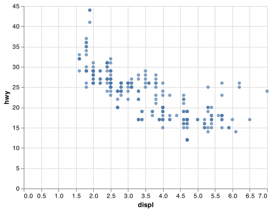

# Project Document Title

__<Jacob Padgett>__

## Elevator pitch

The purpose of the assignment was to get things for the class established. I had gotten the reading done quite quickly and had done the work of the assignment as fast as I expected. I'd rather work in notebook form where code is easier to read, but it still works. I ended up making the code work after two hours 40 minutes with tutors and 40 minutes witrh Brother Hathaway. Downloading the `.png` file was the biggest headach I experienced with things, but I got it.

## TECHNICAL DETAILS

1. Finish the readings and come to class prepared with any questions to get your environment working smoothly.
    * Completed 
2. Create a python script and use VS Code to create the example Altair chart in the assigned readings (note that you have to type chart to see the Altair chart after you run the code). Save your Altair chart for submission.

    * 

## APPENDIX A (PYTHON SCRIPT)

```python
# %%
import pandas as pd
import altair as alt

# %%
alt.data_transformers.enable("json")

# %%
# Reading in data
url = (
    "https://github.com/byuidatascience/data4python4ds/raw/master/data-raw/mpg/mpg.csv"
)
mpg = pd.read_csv(url)

# %%
displ_vs_hwy = alt.Chart(mpg).encode(x="displ", y="hwy").mark_circle()
displ_vs_hwy

# %%
# I'm not too sure about this part of the reading/assignmemnt

# chart = (alt.Chart(<DATA>)
#    .encode(<ENCODINGS>)
#     <.mark_*()>)

# %%
# Run Chart(mpg).mark_point(). What do you see?
alt.Chart(mpg).mark_point()

# %%
# The shape of mpg is 234 rows, 11 columns
mpg.shape

# %% [markdown]

# What does the `drv` variable describe? According to the 
# [data](https://github.com/byuidatascience/data4python4ds/blob/master/data.md#fuel-economy-data-from-1999-to-2008-for-38-popular-models-of-cars),
# `drv` means "the type of drive train, where f = front-wheel drive, r = rear wheel drive, 4 = 4wd"

# %%
# Make a scatterplot of `hwy` vs `cyl`
hwy_vs_cyl_chart = alt.Chart(mpg).encode(x="cyl", y="hwy").mark_circle()
hwy_vs_cyl_chart


# %%
# What happens if you make a scatterplot of `class` vs `drv`? Why is the plot not useful?
# It has nothing to prove regarding the hypothesis that "cars with big engines use more fuel."
class_vs_drv_chart = alt.Chart(mpg).encode(x="class", y="drv").mark_circle()
class_vs_drv_chart

# %%
# Save the chart required
displ_vs_hwy.save("displ_vs_hwy.png")
```

#### Save as `.pdf`

I'm using
```python3
pip install grip  
grip your_markdown.md
```

from [here](https://superuser.com/questions/689056/how-can-i-convert-github-flavored-markdown-to-a-pdf)
