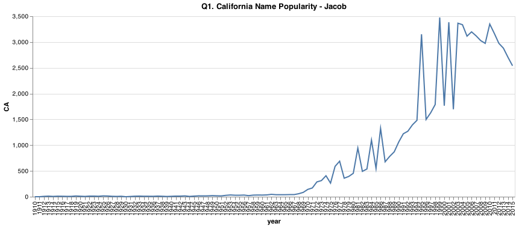
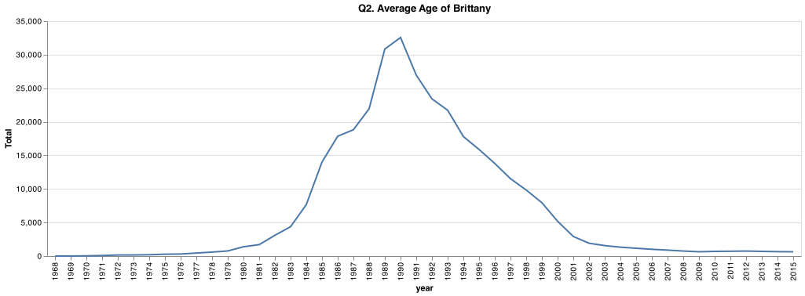
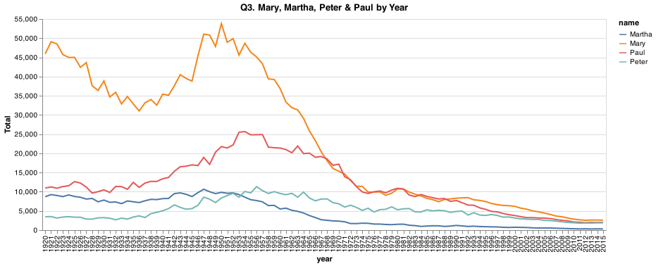
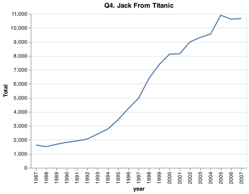

# Week 2

___Jacob Padgett___

## Elevator pitch

* The purpose of this assignment, I believe, was to become even more familar with creating subsets via the `.query()` method, while also learning more about filtering.

## TECHNICAL DETAILS

* _PROVIDE CHARTS THAT ADDRESS THE GRAND QUESTIONS._

Here is the chart for **question 1**



Here is the chart for **question 2**



Here is the chart for **question 3**



Here is the chart for **question 4**



* _YOU MIGHT INCLUDE SMALL CODE SNIPPETS TO HIGHLIGHT DECISIONS._

  * Putting together the code for #2 was fun. getting to make it up to date regardless of when the code is run.

### GRAND QUESTION 1

* The name "Jacob" was used 538 (in CA where I was born) times in 1983 (my birth year) and here's a graph of how it has been used historically.
  * See `Q1. California Name Popularity - Jacob` above for details.

### GRAND QUESTION 2

* The average Brittany was born in June of 1991. This would make the average Brittany 29 years and 10 months, and that's how old I would guess she would be.
  * See `Q2. Average Age of Brittany` above for details.

### GRAND QUESTION 3

* The corresponding chart above shows comparison between the names Mary, Martha, Peter & Paul between the years 1920 & 2020
  * See `Q3. Mary, Martha, Peter & Paul by Year` above for details.

### GRAND QUESTION 4

* With the movie Titanic being released in the year 1997, one of the two main characters, Jack is who I chose to evaluate. The name Jack was already on the up-trend when the movie came out, and it didn't hurt it. In fact, the name kept gaining popularity for about 8 years after..
  * See `Q4. Jack From Titanic` above for details.

...

## APPENDIX A (PYTHON SCRIPT)

```python

```
